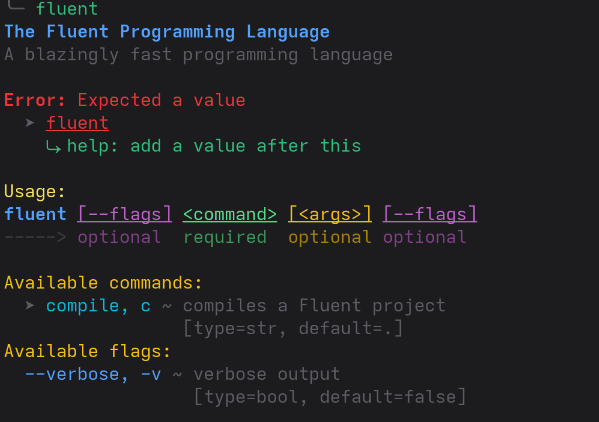
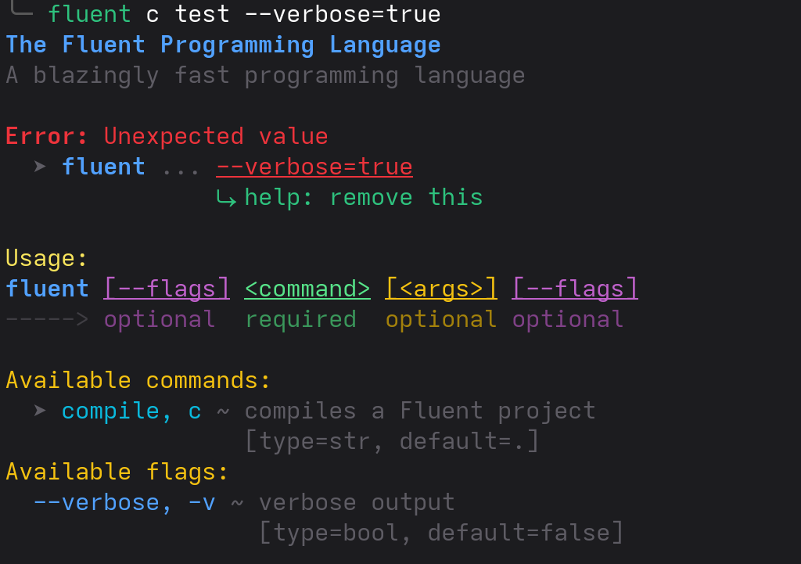

# Zelix CLI

Zelix CLI is a rewrite of the already-existing
[fluent_libc/cli](https://github.com/rodrigoo-r/cli) in C++ instead of C.
It is a library that provides a simple way to create command line interfaces
while staying highly performant.

## Features

- Default values for flags and commands.
- Automatic help generation **(With colors!)**
- Uses [Celery](https://github.com/rodrigoo-r/Celery)
instead of the standard library.
- Mostly zero-copy parsing.
- Easy-to-use API.
- Built with performance in mind.
- [**No `strcmp()` calls**](#performance-considerations).

## Installation

With CMake:

```cmake
include(FetchContent)

FetchContent_Declare(
        zelix_cli
        GIT_REPOSITORY https://github.com/zelix-lang/CLI.git
        GIT_TAG        master
)

FetchContent_MakeAvailable(zelix_cli)
target_link_libraries(Project PRIVATE zelix::cli)
```

## Usage

```c++
#include "zelix/cli/app.h"
using namespace zelix;

int main(const int argc, const char **argv)
{
    cli::app app(
        "The Fluent Programming Language",
        "A blazingly fast programming language",
        argc,
        argv
    );

    const char *compile_cmd = "compile";
    app.command<const char*>(
        compile_cmd,
        "c",
        "compiles a Fluent project",
        "."
    );

    app.flag<bool>(
        "verbose",
        "v",
        "verbose output",
        false
    );

    cli::args args = app.parse();

    if (cli::args::is_err())
    {
        auto help = app.help();
        printf("%s", help.c_str());
        return 1;
    }

    // Zero-copy magic! The pointer is the same as the one passed to the command.
    // No allocations or copies are made.
    if (args.get_cmd().ptr() == compile_cmd)
    {
        printf("compile selected\n");
    }

    return 0;
}
```

## Example help output




## Performance considerations

The parser is mostly zero-copy, meaning that it does not allocate memory
or copy strings when parsing the command line arguments.
This is achieved by using pointers to the original arguments passed to the
application. This means that the arguments are not modified in any way,
and the original pointers are still valid after parsing.

However, there are also some considerations:

- **`strlen()` calls**: Registering commands and flags requires
    `strlen()` calls to determine the length of the command or flag names.
    This is done only once per command or flag, so it should not be a problem
    in most cases. **However, there is a way to avoid this**. If instead of passing
    a `const char*` you pass a `zelix::container::external_string`, the
    library will not call `strlen()` and the parser is still zero-copy.
    **Example**:
    ```c++
    const char *compile_cmd = "compile"; // 7 chars (exclude null terminator)
    app.command<container::external_string>(
        container::external_string(compile_cmd, 7),
        container::external_string("c", 1),
        container::external_string("compiles a Fluent project", 25),
        container::external_string(".", 1)
    );
    ```
- **No `strcmp()` calls**: Once parsing is completed,
    you don't have to use `strcmp()` to compare the
    command or flag names since the library uses pointers to the original
    arguments passed to the application. This means that you can compare
    the pointers directly, which is much faster than using `strcmp()`.
    **Example**:
    ```c++
    const char *compile_cmd = "compile"; // 7 chars (exclude null terminator)
    app.command<container::external_string>(
        container::external_string(compile_cmd, 7),
        container::external_string("c", 1),
        container::external_string("compiles a Fluent project", 25),
        container::external_string(".", 1)
    );
  
    // ...
    // Later:
    cli::args args = app.parse();

    if (cli::args::is_err())
    {
        auto help = app.help();
        printf("%s", help.c_str());
        return 1;
    }

    if (args.get_cmd().ptr() == compile_cmd)
    {
        printf("compile selected\n");
    }
    ```